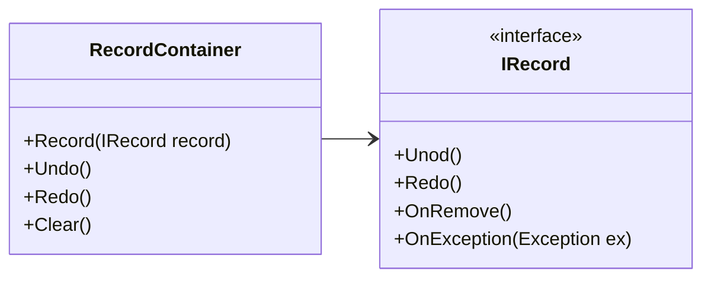
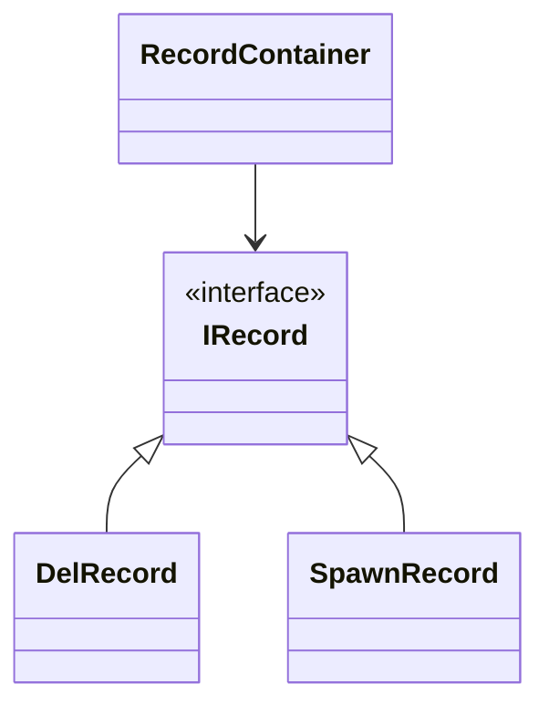

# UndoRedo
撤销还原功能

* 源码的类图

```mermaid
classDiagram
	direction LR
	RecordContainer --> IRecord

	class IRecord{
	<<interface>>
	+Unod()
	+Redo()
	+OnRemove()
	+OnException(Exception ex)
	}
	
	class RecordContainer{
	+Record(IRecord record)
	+Undo()
	+Redo()
	+Clear()
	}
```

* Demo的类图

```mermaid
classDiagram
	IRecord <|-- DelRecord
	IRecord <|-- SpawnRecord
	RecordContainer --> IRecord
	
	class IRecord{
	<<interface>>
	}
	
	class DelRecord
	class SpawnRecord
	
	class RecordContainer{
	}
```

